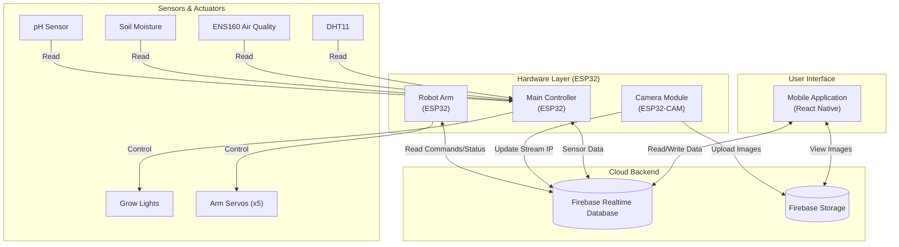

# GitHub Repository Link

https://github.com/Irangi01/Mashroom_mobileApp.git


# Mushroom Monitoring System

A comprehensive IoT-based solution for monitoring and automating mushroom cultivation. This system integrates a mobile application for real-time monitoring and control with custom firmware for ESP32 sensors, robotic arms, and camera modules.

## Table of Contents

- [Project Overview](#project-overview)
- [Repository Structure](#repository-structure)
- [Mobile Application](#mobile-application)
  - [Features](#features)
  - [Screens](#screens)
  - [Getting Started](#getting-started-mobile)
- [Hardware & Firmware](#hardware--firmware)
  - [Main Controller](#main-controller)
  - [Camera Module](#camera-module)
  - [Robot Arm](#robot-arm)
- [QnA](#qna)

---

## Project Overview

The Mushroom Monitoring System is designed to help farmers optimize their yields by providing:

- Real-time environmental monitoring (Temperature, Humidity, Soil Moisture, etc.)
- Automated control of actuators (Fans, Misting, Pumps)
- Image-based disease detection or growth monitoring via ML
- Remote control of a robotic arm for automated tasks

## Repository Structure

```
├── mobile-app/          # React Native mobile application source code
├── firmware/            # ESP32 and Arduino firmware codes
│   ├── main/            # Primary sensor and actuator controller code
│   ├── camera_module/   # ESP32-CAM firmware
│   └── robotArm/        # Robotic arm control logic
└── README.md            # Project documentation
```

---

## Mobile Application

The frontend is built using **React Native** (Expo), providing a cross-platform interface for users to interact with their farm.

### Features

- **Real-time Dashboard**: View live sensor readings from the ESP32 units.
- **Remote Control**: Toggle fans, lights, and water pumps directly from the app.
- **ML Integration**: Analyze images captured by the camera module.
- **Robotic Control**: Manual or automated control interface for the robotic arm.

### Screens

- **DashboardScreen**: The main landing page displaying key metrics (Temp, Humidity, Light).
- **SensorControlsScreen**: Dedicated interface for managing connected sensors and actuators.
- **RobotArmScreen**: Controls for the robotic arm movements.
- **MLModelScreen**: Interface for viewing camera feeds or running inference on mushroom images.

### Getting Started (Mobile)

1. Navigate to the directory:

    ```bash
    cd mobile-app
    ```

2. Install dependencies:

    ```bash
    npm install
    ```

3. Start the app:

    ```bash
    npm start
    ```

    This will launch Metro Bundler. You can scan the QR code with the Expo Go app on your phone.

---

## Hardware & Firmware

The system relies on three main hardware components, all powered by ESP32 microcontrollers.

### 1. Main Controller

Located in `firmware/main`.

- **Purpose**: Central hub for environmental sensors and environment control.
- **Files**:
  - `main.ino`: Entry point. Setup and loop for handling data.
  - `Sensors.cpp`: Logic for reading DHT (Temp/Hum), Soil Moisture, and other sensors.
  - `Actuators.cpp`: Logic for controlling relays (for fans, pumps, etc.).
  - `FirebaseHTTP.cpp`: Handles communication with the Firebase backend to sync data with the mobile app.

### 2. Camera Module

Located in `firmware/camera_module`.

- **Purpose**: Visual monitoring and image data collection for Machine Learning.
- **Hardware**: ESP32-CAM.
- **Functionality**: Captures images and uploads them to the server/storage for processing.

### 3. Robot Arm

Located in `firmware/robotArm`.

- **Purpose**: Physical manipulation (e.g., harvesting or precise watering).
- **Files**: Includes logic for servo motor control to move the arm across multiple axes.
- **Documentation**: See `firmware/robotArm/PINOUT.md` for specific wiring details.

---

## System Architecture

The following block diagram illustrates the high-level architecture of the Mushroom Monitoring System, showing how the mobile app interacts with the hardware via Firebase.



## Hardware Pinouts

### 1. Main Controller (ESP32)

| GPIO | Component | Function |
|------|-----------|----------|
| **4** | DHT11 | Temperature & Humidity Data |
| **15** | Grow Lights | PWM Control (LEDC Ch0) |
| **16** | pH Sensor | RS485 RX (MAX485 RO) |
| **17** | pH Sensor | RS485 TX (MAX485 DI) |
| **21** | ENS160 | I2C SDA |
| **22** | ENS160 | I2C SCL |
| **23** | Soil Sensor | Digital Output (Threshold) |
| **25** | pH Sensor | RS485 Driver Enable (DE) |
| **33** | pH Sensor | RS485 Receiver Enable (RE) |
| **34** | Soil Sensor | Analog Input (ADC1_CH6) |

### 2. Robot Arm (ESP32)

| GPIO | Servo Joint | Note |
|------|-------------|------|
| **12** | Shoulder | Up/Down motion |
| **13** | Base | Rotation (0-180°) |
| **14** | Elbow | Extension |
| **26** | Gripper | Open/Close |
| **27** | Wrist | Orientation |

> **⚠️ Power Note:** Do NOT power the servos directly from the ESP32. Use an external 5V/6V (3A+) power supply for the motors, sharing the ground (GND) with the ESP32.

### 3. Camera Module (ESP32-CAM)

| GPIO | Function |
|------|----------|
| **0** | XCLK |
| **2** | PCLK |
| **4** | Lamp / Flash (Optional) |
| **5** | Y2 (Data) |
| **18** | Y3 (Data) |
| **19** | Y4 (Data) |
| **21** | Y5 (Data) |
| **36** | Y6 (Data) |
| **39** | Y7 (Data) |
| **34** | Y8 (Data) |
| **35** | Y9 (Data) |
| **22** | PCLK |
| **23** | HREF |
| **25** | VSYNC |
| **26** | SIOD (I2C SDA) |
| **27** | SIOC (I2C SCL) |
